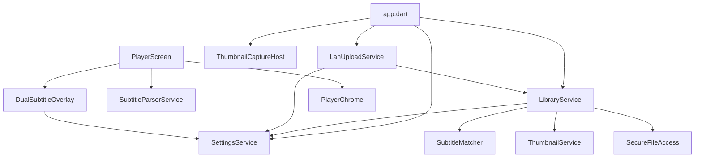

# 架构与工程

## 启动流程

```
main.dart
  MediaKit.ensureInitialized()
  runApp(DoudouPlayerApp)

app.dart
  SettingsService.load()
  LibraryService.load()
  LanUploadService.initialize()   // autoStart 时启动 HTTP
```

## 服务依赖



## 目录结构

```
lib/
├── main.dart / app.dart
├── screens/          # 页面
├── services/         # 业务逻辑
├── models/           # 数据模型
└── widgets/          # 可复用 UI 组件

docs/                 # 功能文档（本目录）
test/                 # 单元/集成测试
test_data/            # 测试用字幕样例
```

## 主要依赖（pubspec.yaml）

| 包 | 用途 |
|----|------|
| `media_kit` / `media_kit_video` / `media_kit_libs_video` | 视频播放 |
| `file_picker` | 非 macOS 文件/目录选择 |
| `shared_preferences` | 设置与视频库索引持久化 |
| `subtitle` | SRT 解析 |
| `path` / `path_provider` | 路径处理与应用目录 |
| `macos_secure_bookmarks` | macOS security-scoped bookmark |
| `shelf` / `shelf_router` / `shelf_multipart` | 局域网上传 HTTP 服务 |

## 持久化

| Key | 内容 | 服务 |
|-----|------|------|
| `video_library` | `VideoItem[]` JSON | `LibraryService` |
| `default_subtitle_mode` 等 | 用户偏好 | `SettingsService` |
| `subtitle_scan_rules` | 字幕后缀规则 JSON | `SettingsService` |
| `lan_upload_settings` | 局域网传输配置 JSON | `SettingsService` |

文件缓存（非 SharedPreferences）：

- `{ApplicationSupport}/thumbnails/*.jpg` — 缩略图
- `{ApplicationSupport}/lan_uploads/` — 局域网上传文件

## 平台配置要点

| 平台 | 文件 | 说明 |
|------|------|------|
| macOS | `macos/Runner/Release.entitlements` | sandbox、`network.server`、bookmark |
| macOS | `macos/Runner/SecureFilePickerPlugin.swift` | 原生文件选择 + bookmark |
| iOS | `ios/Runner/Info.plist` | `NSLocalNetworkUsageDescription` |
| Android | `android/app/src/main/AndroidManifest.xml` | `INTERNET`、存储权限 |

## 测试

| 文件 | 覆盖 |
|------|------|
| `test/library_service_test.dart` | 路径规范化、去重 |
| `test/subtitle_matcher_test.dart` | 字幕匹配 |
| `test/settings_service_test.dart` | 设置持久化 |
| `test/thumbnail_service_test.dart` | 缩略图时间策略 |
| `test/player_chrome_test.dart` | 全屏平台判断 |
| `test/lan_upload_service_test.dart` | LAN 上传 |
| `test/widget_test.dart` | 基础 widget |

运行：`flutter test`

## 构建打包脚本

文件：`scripts/build_multi.sh`

- 支持一次指定多个平台：`android-apk,android-aab,ios,macos,linux,windows,web`
- 默认并行构建，可通过 `-s/--serial` 切换为串行
- 支持 `-m/--mode` 选择 `release/profile/debug`
- 支持 `-o/--output-dir` 将产物集中拷贝到指定目录（按平台分子目录）
- iOS/macOS 可通过 `--no-codesign` 跳过签名
- 每个平台构建日志输出到 `build_logs/<timestamp>/<platform>.log`

示例：

```bash
./scripts/build_multi.sh -p android-apk,ios --no-codesign
./scripts/build_multi.sh -p android-aab,web,macos
./scripts/build_multi.sh -p android-apk,ios -o dist
```

## 开发注意

- 视频库为**引用式**：不复制用户原文件，仅保存路径索引
- macOS 播放/缩略图前需 `LibraryService.ensureAccess()`
- 修改服务 API 或持久化 key 时同步更新 [settings.md](settings.md) / 模块文档
- 新增屏幕或服务时更新 [features.md](features.md) 与本文件的依赖图
